  

# Achyutaram Sonti

### Software Engineer - Backend, Distributed Systems & Applied AI

I am a software engineer with 3+ years of experience building backend and
distributed systems for healthcare and financial applications. My work spans
API and service design, event-driven processing, relational data systems,
performance optimization, automated testing, and production reliability.

I am currently building applied AI products and agentic workflows that plan and
execute multi-step work through tools, preserve durable state, retrieve the
right context, and keep consequential actions observable and human-governed. I
care about the production concerns behind LLM-based systems: evaluation,
latency, cost, failure handling, and trustworthy outputs.

I recently completed an M.S. in Computer Science at Arizona State University
with a 4.00 GPA. I am interested in backend, distributed systems, platform, and
AI systems engineering roles.

## Engineering focus

- **Backend and distributed systems:** microservices, API design, Kafka,
  PostgreSQL, asynchronous processing, concurrency, and failure handling
- **Agentic systems:** tool orchestration, durable execution, human-in-the-loop
  controls, retrieval, evaluation, and auditable workflows
- **Reliability and performance:** idempotency, retries, observability, load
  testing, database optimization, and tail-latency reduction
- **Delivery:** automated testing, CI/CD, Docker, Kubernetes, and AWS

## Selected work

### [Public Records Review Copilot](https://github.com/sontiachyut/public-records-review-copilot)

An AI-assisted evidence-review workflow with citation-grounded retrieval,
source cards, structured findings, and a FastAPI/SQLite backend.

### [AWS Cloud & Edge Inference Platform](https://github.com/sontiachyut/CSE546-Cloud-Computing)

An asynchronous inference pipeline implemented across autoscaling IaaS,
event-driven AWS Lambda, and IoT Greengrass edge architectures.

### [AI Job-Matching Assistant](https://github.com/sontiachyut/CSE573-LinkedIn-Assistant)

A full-stack retrieval and ranking system built with Python, FastAPI, React,
TypeScript, and structured evaluation workflows.

### [NeuroCool AI](https://github.com/sontiachyut/NeuroCool-AI)

A full-stack assistant with a FastAPI backend and React/TypeScript frontend,
designed to turn conversational guidance into manageable tasks and routines.

## Core technologies

- **Languages:** Java, Python, Go, TypeScript, JavaScript, SQL
- **Backend:** Spring Boot, FastAPI, Node.js, REST APIs, Kafka
- **Data:** PostgreSQL, Redis, DynamoDB, SQLite
- **Runtime & delivery:** Docker, Kubernetes, AWS, Terraform, CI/CD
- **Frontend:** React, Next.js

## Connect

[LinkedIn](https://www.linkedin.com/in/asonti/) ·
[Email](mailto:asonti1@asu.edu)
