  

I am a software engineer with 3+ years of experience building Java/Spring Boot services on AWS for global payments. At Infinite Computer Solutions, I worked on payment routing, transaction-state management, processor integrations, and performance. I built 12 REST APIs and four reusable processor adapters, and reduced gateway API p95 response time by 31% through PostgreSQL optimization.

My projects explore the same engineering questions from different angles: how to keep data correct when events arrive late, requests are retried, or a process stops halfway through. I also work on AI-native workflows that retrieve relevant evidence, use LLMs in bounded stages, and preserve execution state so failures can be inspected and recovered.

I earned an M.S. in Computer Science from Arizona State University with a 4.0 GPA. I’m interested in software engineering roles across distributed systems, full-stack products, cloud applications, and applied AI.

## Engineering focus

- **Backend and distributed systems:** Java, Spring Boot, REST APIs, PostgreSQL, Kafka, concurrency, and asynchronous processing
- **Correctness and performance:** idempotency, retries, transactional state, failure recovery, query optimization, and p95 latency
- **Full-stack and AI applications:** React, TypeScript, Python, retrieval, LLM workflows, and PyTorch
- **Delivery:** AWS, Docker, Kubernetes, automated testing, and CI/CD

## Selected work

### [Verified Offers](https://github.com/sontiachyut/verified-offers)
A merchant-offer search and verification system built with Java, Spring Boot, PostgreSQL, Kafka, OpenSearch, and a React/ TypeScript console. It uses a transactional outbox and versioned indexing, then checks current source facts before returning search results. Merchant feeds have durable receipts and restart recovery.

### [Inventory Fulfillment](https://github.com/sontiachyut/inventory-fulfillment)
A Java/PostgreSQL reservation system built around explicit state transitions, durable idempotency, stock conservation, and concurrent requests. Reservation changes and outbox events commit together.

### [AI Job-Matching Assistant](https://github.com/sontiachyut/CSE573-LinkedIn-Assistant)
A FastAPI and Next.js application that parses resumes and compares them with job requirements. It combines retrieval with explainable scoring and a multi-step interface for exploring matches.

### [AWS Cloud & Edge Inference](https://github.com/sontiachyut/CSE546-Cloud-Computing)
Cloud and edge inference projects spanning AWS Lambda and IoT Greengrass. The face-recognition pipeline uses MQTT, SQS, Lambda, and PyTorch to separate edge ingestion from asynchronous cloud processing.

## Core technologies

**Languages:** Java, Python, TypeScript, JavaScript, SQL
**Backend and data:** Spring Boot, FastAPI, REST APIs, PostgreSQL, Redis, Kafka, OpenSearch
**Cloud and delivery:** AWS, Docker, Kubernetes, Jenkins, CI/CD
**Frontend and AI:** React, Next.js, retrieval/RAG, LLM workflows, PyTorch
